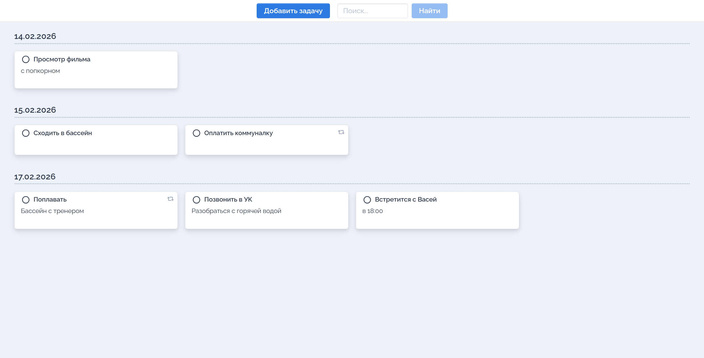
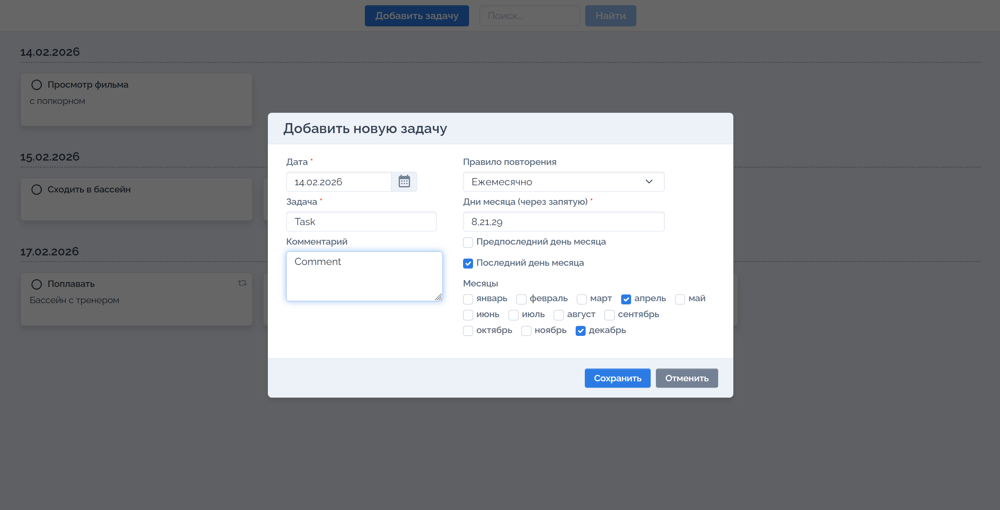

<p align="center">
  
</p>

<p align="center">
  <ins><b><font size="10">𝐆𝐎-𝐓𝐎𝐃𝐎 𝐀𝐏𝐏</font></b></ins>
</p>

<p align="center">
  <a href="https://go.dev/"></a>&nbsp;<a href="https://github.com/mascotmascot1/go-todo/releases/tag/v1.0.0"></a>&nbsp;<a href="https://hub.docker.com/repository/docker/mascotmascot1/go-todo/general"></a>&nbsp;<a href="https://github.com/mascotmascot1/go-todo/blob/main/LICENSE"></a>
</p>

<br>

### ⬛ Описание проекта

Программа представляет из себя планировщик задач.
Порой бывает тяжело удержать все планы, обязанности, задачи и т.д. в голове и на этот случай данное приложение придется как никогда кстати.

Позволяет через веб-интерфейс добавлять/изменять/удалять/обновлять задачи. Также присутствует функционал задания условий повтора задачи, если необходимо ее выполнять с определенными интервалом дней, раз в год или по определенным числам недели/месяца.

В целях конфиденциальности данных, в приложении реализован механизм аутентификации. Доступ к API ограничивается, если в конфигурации заданы **оба** параметра:

* `TODO_PASSWORD` — пароль для авторизации.
* `TODO_SECRETKEY` — секретный ключ для подписи и проверки валидности JWT-токенов.

> **Важно:** Если задан TODO_PASSWORD, но не задан TODO_SECRETKEY, сервер выдаст ошибку конфигурации и не запустится.

---

### ⬛ Ключевые особенности и архитектура:

* **Алгоритмическая оптимизация дат:**
    
    * **O(1) (Константное время):** Применяется для сложных правил — недель (`w`) и месяцев (`m`). Вместо итеративного перебора календаря используется прямой расчет целевой даты через математическое смещение. Это позволяет вычислять дату за один шаг, независимо от того, насколько далеко она находится.
        
    * **O(n) (Линейное время):** Применяется для простых интервалов (дни `d`, годы `y`). Реализовано через итерации, что упрощает логику и чтение кода. Для данных сценариев количество итераций $n$ остается незначительным, но при необходимости алгоритм может быть адаптирован под $O(1)$.
* **Расширенная логика повторения задач:** реализован расчет дат для сложных интервалов (недели, месяцы).
* **Поиск:** реализован поиск задач по частичному совпадению в заголовке и описании.
* **Работа с окружением:** конфигурация сервера (порт, база данных, секреты, хост) реализована через переменные окружения.
* **Аутентификация:** доступ защищен паролем и JWT-токенами.
* **Контейнеризация:** проект полностью готов к запуску через Docker.
* **CI:** При каждом пуше в `main` автоматически запускаются линтеры (`go vet`) и полный цикл интеграционных тестов в изолированном контейнере.
* **CD:** При создании нового тега (релиза) настроена автоматическая сборка и публикация Docker-образа в Docker Hub.
> **Примечание:** В ближайших планах — расширение CD для автоматической сборки и публикации кроссплатформенных бинарных файлов (Windows/Linux) в GitHub Releases.

---

### ⬛ Интерфейс приложения

<table align="center">
  <tr>
    <td align="center"><b>Главный экран</b></td>
  </tr>
  <tr>
    <td align="center">
      
    </td>
  </tr>
  <tr>
    <td align="center"><b>Добавление новой задачи</b></td>
  </tr>
  <tr>
    <td align="center">
      
    </td>
  </tr>
</table>

> **🌙 Забота о зрении и UI:** Скриншоты ниже сделаны с использованием расширения **[Dark Reader](https://darkreader.org/)**. По умолчанию у приложения чистый светлый интерфейс, но для комфортной работы в ночное время — рекомендую использовать подобные инструменты. Берегите свои глаза!

---

### ⬛ Инструкция по запуску

#### Локальный запуск

По умолчанию сервер использует настройки из `internal/config/config.go` (хост localhost, порт 7540, база `scheduler.db`).

**Команда для запуска:**

```bash
go run cmd/go-todo/main.go

```

После запуска откройте в браузере: http://localhost:7540

> **Важно:** по умолчанию директория `web/` с frontend-файлами должна находиться в корне проекта рядом с собранным бинарником или при запуске через `go run`.
> Путь к статическим файлам можно изменить в файле [`internal/config/config.go`](internal/config/config.go).
>
> Сервер ожидает статические файлы относительно рабочей директории.


#### Конфигурация

Параметры сервера можно переопределить через переменные окружения:

* `TODO_HOST` — порт (по умолчанию 127.0.0.1).
* `TODO_PORT` — порт (по умолчанию 7540).
* `TODO_DBFILE` — путь к файлу БД.
* `TODO_PASSWORD` — пароль (для включения аутентификации).
* `TODO_SECRETKEY` — секретный ключ (обязателен, если задан пароль).

---

<details>
<summary><h3>⬛ Ручной запуск тестов с авторизацией (подробно)</h3></summary>

#### **Алгоритм запуска тестов с проверкой аутентификации:**

Параметры для тестов находятся в файле `tests/settings.go`.
Используемые значения по умолчанию:

```go
var (
    Port         = 7540
    DBFile       = "../scheduler.db"
    FullNextDate = true
    Search       = true
    Token        = `` // Заполняется вручную для тестов с аутентификацией
)
```

#### **Алгоритм запуска тестов с проверкой аутентификации:**


1. **Задайте переменные окружения:**
*Bash (Linux/macOS):*
```bash
export TODO_PASSWORD="the_hardest_password"
export TODO_SECRETKEY="the_hardest_secretkey"

```


*PowerShell (Windows):*
```powershell
$env:TODO_PASSWORD="the_hardest_password"
$env:TODO_SECRETKEY="the_hardest_secretkey"

```


2. **Запустите сервер:**
```bash
go run cmd/go-todo/main.go

```

3. **Получите токен (в отдельном окне терминала):**
*Bash (Linux/macOS):*
```bash
curl -s -X POST http://localhost:7540/api/signin \
     -H "Content-Type: application/json" \
     -d '{"password":"the_hardest_password"}'

```


*PowerShell (Windows):*
```powershell
$body = @{ password = "the_hardest_password" } | ConvertTo-Json
(Invoke-RestMethod -Method POST -Uri "http://localhost:7540/api/signin" -ContentType "application/json" -Body $body).token

```


4. **Пропишите токен в файл настроек:**
Скопируйте полученный токен и вставьте его в переменную `Token` в файле `tests/settings.go`:
```go
var (
    // ...
    Token = `ВАШ_СКОПИРОВАННЫЙ_ТОКЕН`
)

```


5. **Запустите тесты:**
```bash
go test -count=1 ./tests

```

</details>

---

### ⬛ Инструкция по сборке и запуску через Docker

В образе настроены переменные окружения по умолчанию:

* `TODO_DBFILE=/app/data/scheduler.db` (база данных хранится в директории `/app/data`)
* `TODO_HOST="0.0.0.0"`
* `TODO_PORT=7540`

#### 1. Быстрый запуск из Docker Hub (Рекомендуется)

Проект автоматически собирается через CI/CD и доступен в [Docker Hub](https://hub.docker.com/repository/docker/mascotmascot1/go-todo/general). 
Вам не нужно клонировать репозиторий, достаточно выполнить команду для загрузки образа:

```bash
docker pull mascotmascot1/go-todo:latest
```

*Затем сразу переходите к шагу 3.*

##### 2. Локальная сборка

Если вы скачали репозиторий и хотите собрать образ самостоятельно, то выполните команду сборки, находясь в корневой директории проекта (там, где расположен Dockerfile):

```bash
docker build -t go-todo .
```

#### 3. Запуск контейнера

*(В команде ниже используйте имя образа `go-todo`, если собирали сами, или `mascotmascot1/go-todo:latest`, если скачали готовый).*

Команда ниже монтирует текущую папку хоста в `/app/data` контейнера. Это позволяет сохранить файл базы данных `scheduler.db` на вашем диске даже после остановки контейнера.

**Bash (Linux/macOS):**

```bash
docker run -p 7540:7540 \
  -v "${PWD}:/app/data" \
  -e TODO_PASSWORD="the_hardest_password" \
  -e TODO_SECRETKEY="the_hardest_secretkey" \
  go-todo

```


**PowerShell (Windows):**

```powershell
docker run -p 7540:7540 `
  -v "${PWD}:/app/data" `
  -e TODO_PASSWORD="the_hardest_password" `
  -e TODO_SECRETKEY="the_hardest_secretkey" `
  go-todo

```

---

### ⬛ Лицензия

Проект распространяется под лицензией **MIT**.
Подробности см. в файле [`LICENSE`](./LICENSE).

* **Backend:** Разработан полностью самостоятельно (Roman Sheptytsky/ mascotmascot1).
* **Frontend:** Предоставлен в рамках учебного курса (использован в качестве интерфейса для демонстрации работы API).
